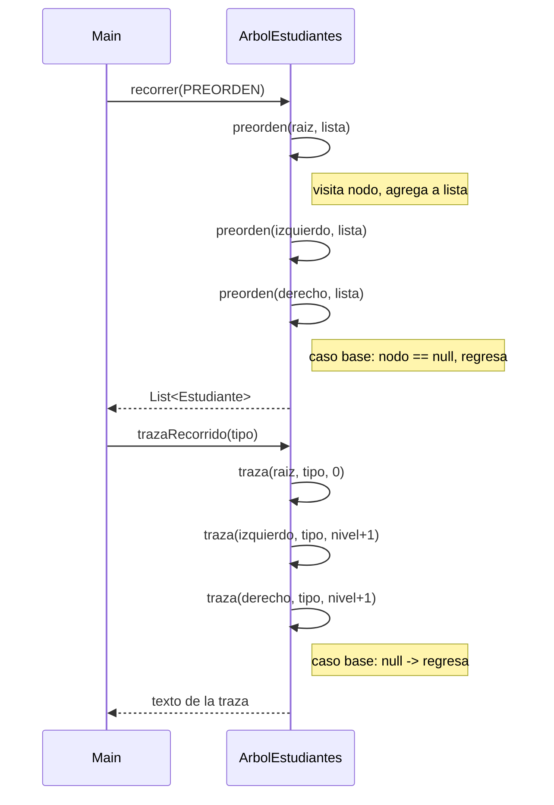

# Secuencia de recorridos

```mermaid
sequenceDiagram
    participant Main
    participant ArbolEstudiantes as ArbolEstudiantes

    Main->>ArbolEstudiantes: recorrer(PREORDEN)
    ArbolEstudiantes->>ArbolEstudiantes: preorden(raiz, lista)
    Note right of ArbolEstudiantes: visita nodo, agrega a lista
    ArbolEstudiantes->>ArbolEstudiantes: preorden(izquierdo, lista)
    ArbolEstudiantes->>ArbolEstudiantes: preorden(derecho, lista)
    Note right of ArbolEstudiantes: caso base: nodo == null, regresa
    ArbolEstudiantes-->>Main: List<Estudiante>

    Main->>ArbolEstudiantes: trazaRecorrido(tipo)
    ArbolEstudiantes->>ArbolEstudiantes: traza(raiz, tipo, 0)
    ArbolEstudiantes->>ArbolEstudiantes: traza(izquierdo, tipo, nivel+1)
    ArbolEstudiantes->>ArbolEstudiantes: traza(derecho, tipo, nivel+1)
    Note right of ArbolEstudiantes: caso base: null -> regresa
    ArbolEstudiantes-->>Main: texto de la traza
```

En PREORDEN cada nodo se visita antes que sus hijos. Para el paralelo SW-N3-B (con el 45 de Kenneth) la secuencia es: 50 30 20 40 35 45 70 60 65 80. Complejidad O(n).
